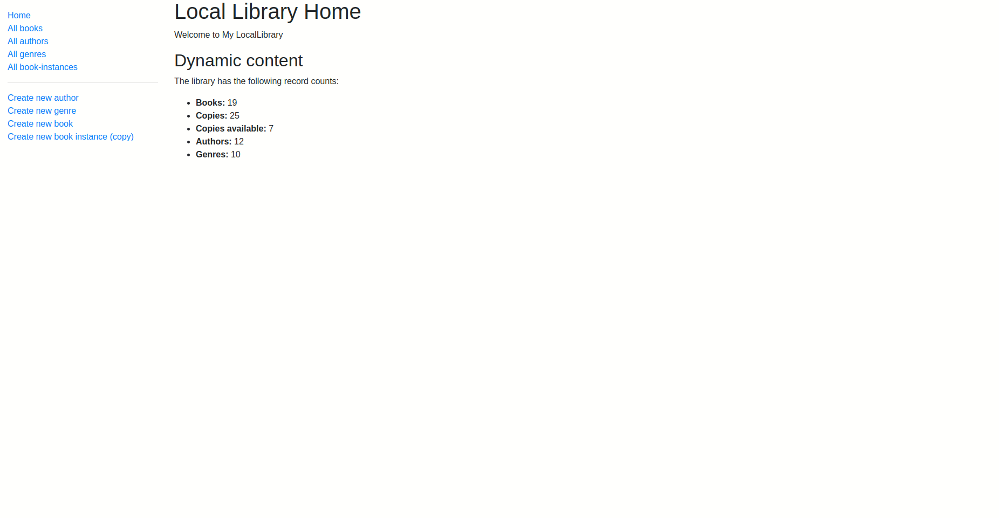

# Local Library With NodeJS

# Demo
You can check out a demo of the app [here](https://locallibrarynodejs-production.up.railway.app/).


# I have learned these:

These will be some notes that I faced while developing this project

## difference between module.exports & exports

exports: This is a shorthand for ```module.exports```. It's initially set to reference the same object as ```module.exports```, but if you assign a value directly to ```exports```, it will break the reference between ```exports``` and ```module.exports```.

For example:

```js
// module.js
exports.foo = 'bar';
```

In this case, exports is still referencing the same object as module.exports, so when you require this module, you'll get an object with a foo property set to 'bar'.

However, if you were to do something like this:

```js
// module.js
exports = {
    foo: 'bar'
};
```

In this case, you're reassigning ```exports``` to a new object, breaking the reference with ```module.exports```. So when you require this module, you won't get the object with the foo property; instead, you'll get an empty object. This is because require returns ```module.exports```, not ```exports```.

## The order of the routes in the code

If we have routes like these

```js
// GET request for creating a Book. NOTE This must come before routes that display Book (uses id).
router.get("/book/create", book_controller.book_create_get);

// GET request for one Book.
router.get("/book/:id", book_controller.book_detail);
```

The route ```/book/create``` must come before ```/book/:id``` because if the ```/book/:id``` comes first, it will matches the ```/book/create"```. But not vice versa

## Making two independent requests

If the two requests do not depend on each other, we use Promise.all() to run the database queries in parallel

uses Promise.all to fetch the genre and its books in parallel, which is more efficient as it reduces the total wait time by running both queries concurrently.

***Not*** efficient code
```js
const selectedGenre = await Genre.findById(req.params.id);
const allbooks = await Book.find({ genre: selectedGenre }, 'title summary').populate('genre')
```

efficient code
```js
const [genre, booksInGenre] = await Promise.all([
    Genre.findById(req.params.id).exec(),
    Book.find({ genre: req.params.id }, 'title summary').exec()
]);
```
## cross-site scripting VS Cross-site request forgery
Cross-Site Request Forgery (CSRF) attacks occur when an attacker tricks a user's browser into making an unintended request to a different website where the user is authenticated.

Unlike cross-site scripting (XSS), which exploits the trust a user has for a particular site, CSRF exploits the trust that a site has in a user's browser.

## How can POST request prevent CSRF?
* **Token Generation:** When a user visits a website, the server generates a unique token and includes it in the user's session in the server.
* **Token Validation:** For every state-changing request (usually POST requests), the server includes this token in the generated form (often as a hidden field). When the form is submitted, the token is sent back to the server.
```html
<form action="/update-profile" method="post">
    <!-- Other form fields -->
    <input type="hidden" name="csrf_token" value="generated_csrf_token_here">
    <button type="submit">Update Profile</button>
</form>
```
* **Server-Side Check:** The server verifies the token against the one stored in the user's session. If the token is missing or invalid, the request is rejected.

## Can't we send the form (state-changing request) using GET?

Technically, you can send form data using a GET request, but it's not recommended, especially for state-changing actions. Here's why:

1. **Security Concerns**: Using GET requests for state-changing actions can expose sensitive data as the form fields are appended to the URL. This makes the data visible in browser history, server logs, and potentially to malicious actors.

2. **Limitation on Data Size**: GET requests have limitations on the amount of data that can be sent, typically around 2,048 characters. This restricts the amount of form data you can include.

3. **Security Best Practices**: For security reasons and to adhere to RESTful principles, it's a best practice to use POST requests for actions that modify data on the server. This helps differentiate between safe (GET) and unsafe (POST, PUT, DELETE, etc.) operations.

4. **CSRF Vulnerabilities**: Using GET requests for state-changing actions does not inherently mitigate Cross-Site Request Forgery (CSRF) vulnerabilities. CSRF attacks can still be executed against GET requests, making them less secure for sensitive actions. Why?
    * GET requests typically include parameters in the URL itself. For example, when you submit a form using a GET request, the form data is appended to the URL as query parameters.
    * GET requests are more likely to be cached by browsers or pre-fetched by web browsers or proxy servers. This behavior can lead to unintended execution of actions without the user's explicit interaction.
    * GET requests are often bookmarked by users or saved in their browsing history. If a user bookmarks a page containing a state-changing GET request (e.g., deleting a record), they might unintentionally trigger that action when revisiting the bookmark.
    * GET requests are meant to be idempotent, meaning they should not have any side effects on the server's state. However, this isn't always enforced, and developers might inadvertently design APIs or endpoints that perform state-changing actions with GET requests.

When a form is submitted via POST request, the CSRF token is sent along with the request data in ```the body``` of the HTTP request. However, with GET requests, form data is included in the ```URL```, not in the request body. 

## Node.JS Middlewares

The entire idea of middleware is to execute some code before the controller action that sends the response and after the server gets the request from the client.

[How To Use And Write Express Middleware
](https://blog.webdevsimplified.com/2019-12/express-middleware-in-depth/)

## User Authentication
The vert basic wqy is to store password in the DB and when using log in check the entered password with the stored one. But the DB in this case is insecure and if an attacker can attack this DB, all accounts are stolen!

We can think of something like hashing. We can hash the password before storing it in the DB. When the user log in, we take the password and hash it and compare it with the hashed one stored in the DB.

Bu the hash finction are knowen. The attacker may create a table of top 5000 passwored used (like 12345 and 88888888..) and hash these passwords to create smoething called rainbow table.

## Rainbow table
This table is a mab between passwords and the hashed version of these passwords. The process of ccreating the table may take time but it is needed only once. So in the case the DB is no more secure and if the attacker attacks the DB, he can campare the hashed passwords in the DB withthe hashed passwords in the rainbow table.

## Salt
This make the hashed password unique even if the password is the same, but each time it is hashed will result in a new hashed version. To do this we use something called salt.

Salt is some randomness added to the hash function

```js
hash_function(salt, password)
```
## Cooki VS Session

**_Note_** Session data is not saved in the cookie itself, just the session ID. Session data is stored server-side.

Since the session is stored on the server, it can store sensitive information. Storing sensitive information in a cookie would be highly insecure.

## JWT VS local
The main difference is that JWT need not to be stores in a database controlled by the server. It is only stored by the client and when the server need to check (authorize) the client, it regenerate the JWT and compare between the one sent form the client and the one just generated.

The cooki need to be stored somewhare by serve.

This is useful when we have two ore more servers serving our system for load balancing for example. In case of normal cooki, we need to store the session in two places so that each server can get the session independent from the other (Note that using ine database that the two servers use it may not be applicable). But using JWT, the two servers need only to know the secret.

## passport-local strategy
```passport-local``` is a middleware that modifies an object created by another middleware ```express-session```.

## Some random stuff
Express know the error handling middleware from the norla middleware by the number of the parameters.

The normal middleware take 3 params ```(req, res, next)```. But the Error handling middleware takes 4 ```(err, req, res, next)```.

Middlewares are chained so that they can be used in order. If there is an error in the 2nd middleware, Express need to populate this error to the error handler middleware. Normaly this middleware is the last one in the chain. But in general, express uses the length property of a function (middleware) to know the number of params. So that it can know the first error handling middleware in the chain.

```js
app.use(middleware1)
app.use(middleware2)
app.use((err,req,res,next)=>{
  console.log(err.message);
})
app.use(middleware3)
app.use(middleware4)
app.get('/', ( req, res, next) => {

  res.send(`Hello`);
});
function middleware1(req, res, next){
  console.log('middleware1');
  next(new Error("error"));
}
function middleware2(req, res, next){
  console.log('middleware2');
  next();
}
function middleware3(req, res, next){
  console.log('middleware3');
  next();
}
function middleware4(req, res, next){
  console.log('middleware4');
  next();
}
```
```
middleware1
error
```
Hay!, never make something like this

```js
app.use(middleware1())
// app.use(middleware1) => right
```
## Passport local strategy
### 1. Login Route:
```js
app.use(passport.initialize())
```
* We use this middleware to make authentication the first time the user log in or when the cooki of the user is expired.

```js
app.post('/login', passport.authenticate('local', {
  successRedirect: '/success',
  failureRedirect: '/login'
}));
```

If successful, ```passport.serializeUser``` stores the ```user ID``` in the session.
```js
passport.serializeUser(function(user, done) {
  done(null, user.id); // Store user ID in the session
});
```
### 2. Subsequent Requests:
```js
app.use(passport.session())
```
* For each subsequent request, passport.session middleware is invoked.
* It reads the user ID from the session and calls ```passport.deserializeUser``` to fetch the user object form the store.
```js
passport.deserializeUser(function(id, done) {
  User.findById(id, function (err, user) {
    done(err, user); // Attach user object to req.user
  });
});
```
  * The user object is then attached to ```req.user```.
```js
app.get('/success', (req, res) => {
  res.send(`Logged in successfully as ${req.user.username}`);
});

app.get('/login', (req, res) => {
  res.send('Login Page');
});
```
## Deploying to production
### IaaS
* IaaS: Provides virtualized computing resources over the internet.

|Preinstalled Operating Systems|Fully-Featured Environments|
|:-:|---|
|You can choose a virtual machine with an operating system already installed.|Some IaaS vendors offer environments with Node.js and other tools already set up.|
|Installing Your Production Environment: You need to set up Node.js and other necessary components on the virtual machine after choosing the OS.|   |

## IaaS VS PaaS
||**IaaS**|**Paas**|
|---|---|---|
|**Control and Customization**|Provides more control and customization over the computing environment.|Offers less control but simplifies the development and deployment process.|
|**Management Responsibility**|You are responsible for managing the virtual machines, including the operating system, updates, patches, and the software stack.|The provider manages the infrastructure, operating system, and middleware.|
|**Use Cases**|Suitable for applications requiring custom environments, specific configurations, or where you need control over the infrastructure.|Ideal for applications where you want to focus on development without worrying about infrastructure management.|

## Notes about Deploying
* The main things to think about when publishing your website are ```web security``` and ```performance```.

  At the bare minimum:
  * you will want to modify the database configuration so that you can use a different database for production and secure its credentials.
  * Remove the stack traces that are included on error pages during development.
  * Tidy up your logging, and set the appropriate headers to avoid many common security threats.

## Why Set NODE_ENV to 'production'?
Setting NODE_ENV to 'production' can significantly boost application performance. As mentioned, it can improve performance by a factor of three, primarily due to the following reasons:

* Reduced overhead from not recompiling templates and static files on every request.
* Less logging and error handling overhead, resulting in faster response times.

## Compression for responses
Web servers can often compress the HTTP response sent back to a client, significantly reducing the time required for the client to get and load the page. The compression method used will depend on the decompression methods the client says it supports in the request (the response will be sent uncompressed if no compression methods are supported).

```
Note: For a high-traffic website in production you wouldn't use this middleware. Instead, you would use a reverse proxy like Nginx.
```
## Helmet Middleware
Helmet is a collection of 15 smaller middleware functions that set HTTP headers to help secure your app. Helmet can protect against some common web vulnerabilities by setting appropriate HTTP headers.

## Content Security Policy (CSP)
CSP is a security feature that helps prevent a variety of attacks such as Cross-Site Scripting (XSS) and data injection attacks. It works by specifying which sources are allowed to load content on your site.

```js
app.use(
  helmet.contentSecurityPolicy({
    directives: {
      "script-src": ["'self'", "code.jquery.com", "cdn.jsdelivr.net"],
    },
  }),
);
```

* "script-src":

Specifies valid sources for JavaScript. The values in this array determine which sources are allowed to serve scripts.

## CSP Directives in Detail
* "'self'":

Allows scripts to be loaded from the same origin as the page. This means any scripts hosted on your own server are permitted.

* "code.jquery.com":

Allows scripts to be loaded from code.jquery.com. This is a common CDN (Content Delivery Network) for jQuery.

* "cdn.jsdelivr.net":

Allows scripts to be loaded from cdn.jsdelivr.net. This is another CDN often used for serving libraries like Bootstrap and other frontend assets.

## Rate limiting to the API routes

Express-rate-limit is a middleware package that can be used to limit repeated requests to APIs and endpoints. There are many reasons why excessive requests might be made to your site, such as denial of service attacks, brute force attacks, or even just a client or script that is not behaving as expected. Aside from performance issues that can arise from too many requests causing your server to slow down, you may also be charged for the additional traffic. This package can be used to limit the number of requests that can be made to a particular route or set of routes.
